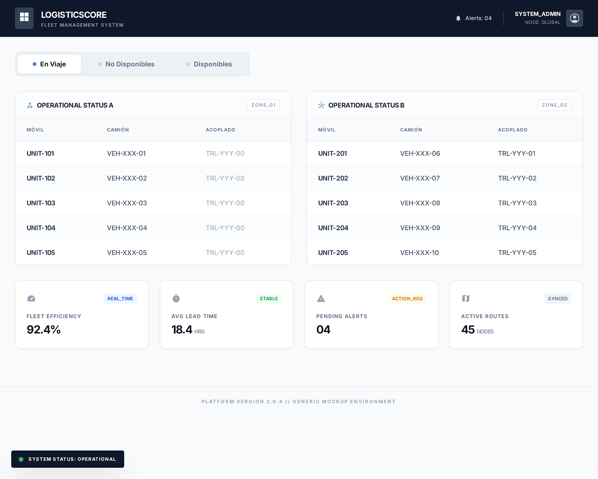
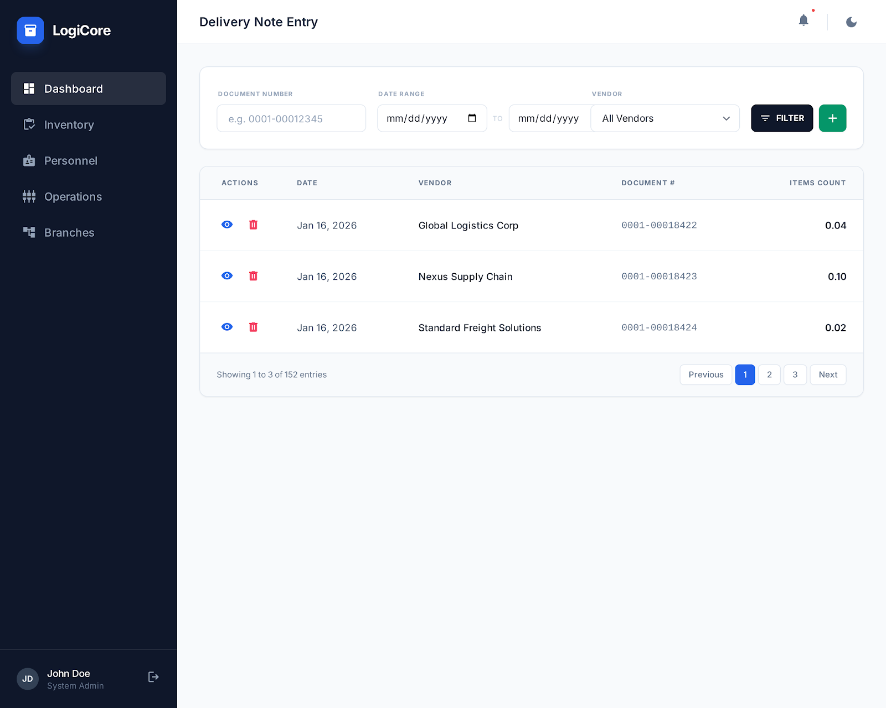
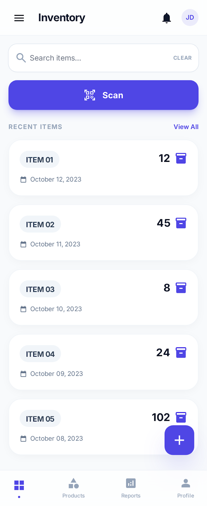

# 🧩 Sistemas de Gestión – Mockups Ilustrativos

Este repositorio contiene **mockups e interfaces ilustrativas** que representan el tipo de sistemas de gestión en los que trabajo actualmente a nivel profesional.

Las imágenes **NO corresponden a sistemas reales**, ni contienen datos, marcas o información de clientes.  
Fueron **rediseñadas con fines demostrativos**, respetando la confidencialidad y seguridad de los proyectos reales.

---

## 🎯 Objetivo del repositorio

El objetivo de este repositorio es **mostrar el tipo de soluciones, arquitecturas y experiencias de usuario** que desarrollo en mi trabajo diario, sin exponer código ni información privada.

Sirve como material de referencia para:
- Reclutadores
- Entrevistas técnicas
- Portfolio profesional
- LinkedIn y GitHub Profile

---

## 🏢 Tipo de proyectos representados

Las interfaces ilustradas reflejan sistemas como:

- Sistemas de gestión comercial (ventas, stock, clientes)
- Aplicaciones web administrativas
- Sistemas **multiempresa** y **multisucursal**
- Dashboards operativos y paneles de control
- Aplicaciones móviles para supermercados y logística
- Paneles de seguimiento (ej. flotas, camiones, lotes)

---

## 🛠️ Tecnologías utilizadas en proyectos reales

Los proyectos reales en los que se basan estos mockups suelen estar desarrollados con:

- **JavaScript / TypeScript**
- **Node.js** (backend)
- **React** (frontend)
- Sistemas basados en plantillas web
- **Tailwind CSS** y **Bootstrap**
- Bases de datos SQL
- Arquitecturas escalables para múltiples empresas y sucursales

> ⚠️ Este repositorio no contiene el código fuente real de dichos sistemas.

---

## 🖼️ Interfaces ilustrativas

> Las siguientes imágenes son **mockups conceptuales**, generados a partir de experiencia real en sistemas de gestión.
> Datos, nombres y marcas son ficticios.

---

## 🔐 Nota sobre confidencialidad

Por razones de seguridad y confidencialidad:
- No se incluye código real
- No se incluyen capturas reales
- No se menciona información sensible de clientes o empresas

Las imágenes buscan **capturar la esencia funcional y visual** de los sistemas, no replicarlos.

---

## 👩‍💻 Sobre mí

Soy **Técnica Universitaria en Programación (UTN)** y estudiante de **Ingeniería en Sistemas**.  
Trabajo como desarrolladora en sistemas de gestión empresariales, participando en proyectos web y mobile, tanto en frontend como backend.

📍 Argentina  
🔗 [LinkedIn](https://www.linkedin.com/in/zoe-nazarena-barrios-55119525a/)  
🌐 [Portfolio](https://portfolio-2025-barrios.vercel.app/)

---

## 📌 Disclaimer

Este repositorio tiene un fin **puramente demostrativo y profesional**.
No representa productos finales ni software comercializable.
